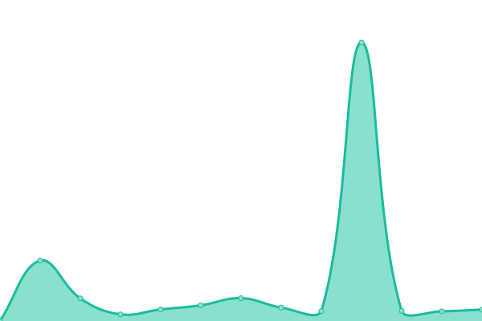
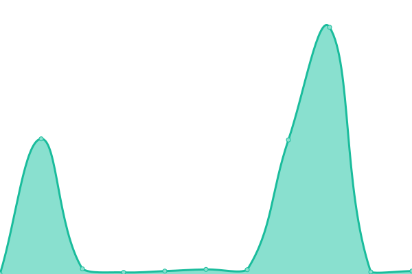
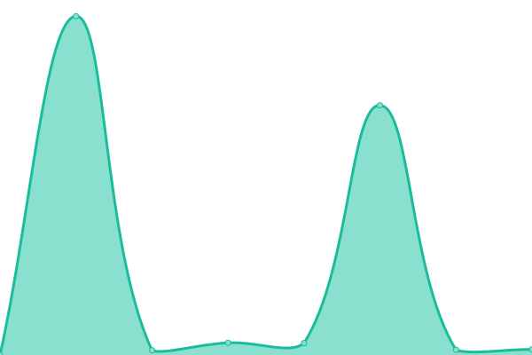

# [📈 Live Status](https://GetRSS.github.io/upptime): <!--live status--> **🟧 Partial outage**

This repository contains the open-source uptime monitor and status page for [RSS](https://www.reddit.com/r/rss/), powered by [Upptime](https://github.com/upptime/upptime).

With [Upptime](https://upptime.js.org), you can get your own unlimited and free uptime monitor and status page, powered entirely by a GitHub repository. We use [Issues](https://github.com/GetRSS/upptime/issues) as incident reports, [Actions](https://github.com/GetRSS/upptime/actions) as uptime monitors, and [Pages](https://GetRSS.github.io/upptime) for the status page.

<!--start: status pages-->
<!-- This summary is generated by Upptime (https://github.com/upptime/upptime) -->
<!-- Do not edit this manually, your changes will be overwritten -->
<!-- prettier-ignore -->
| URL | Status | History | Response Time | Uptime |
| --- | ------ | ------- | ------------- | ------ |
|  RSSBox | 🟩 Up | [rss-box.yml](https://github.com/GetRSS/upptime/commits/HEAD/history/rss-box.yml) | 

 1860ms
     
 | 

<a href="https://GetRSS.github.io/upptime/history/rss-box">99.10%</a>
    

|  RSSHub | 🟥 Down | [rss-hub.yml](https://github.com/GetRSS/upptime/commits/HEAD/history/rss-hub.yml) | 

 183ms
     
 | 

<a href="https://GetRSS.github.io/upptime/history/rss-hub">0.00%</a>
    

|  RSS-Bridge | 🟩 Up | [rss-bridge.yml](https://github.com/GetRSS/upptime/commits/HEAD/history/rss-bridge.yml) | 

 3534ms
     
 | 

<a href="https://GetRSS.github.io/upptime/history/rss-bridge">98.53%</a>
    

|  Reddit-RSS | 🟥 Down | [reddit-rss.yml](https://github.com/GetRSS/upptime/commits/HEAD/history/reddit-rss.yml) | 

 266ms
     
 | 

<a href="https://GetRSS.github.io/upptime/history/reddit-rss">0.00%</a>
    

<!--end: status pages-->

[**Visit our status website →**](https://GetRSS.github.io/upptime)

## 📄 License

- Powered by: [Upptime](https://github.com/upptime/upptime)
- Code: [MIT](./LICENSE) © [RSS](https://www.reddit.com/r/rss/)
- Data in the `./history` directory: [Open Database License](https://opendatacommons.org/licenses/odbl/1-0/)
